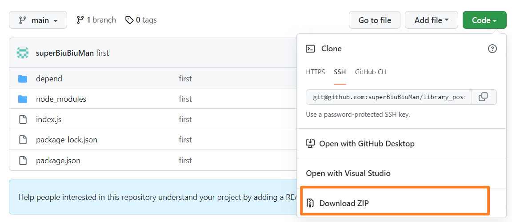
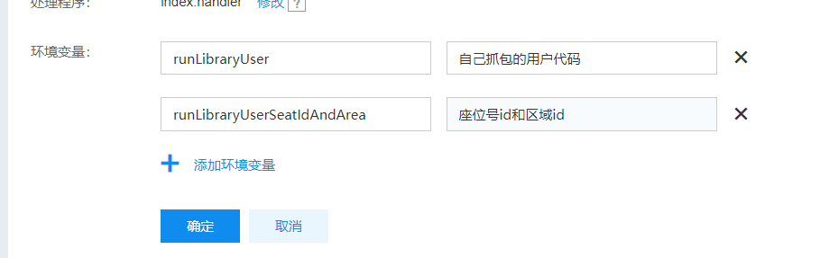

#### 前言

* 抓包的话就不多说啦

* 只实现四楼自动抢,其他楼自己改改就可以

* 先下载下代码,[单击我进入跳转下载](https://github.com/superBiuBiuMan/library_position)

* 下载代码后的操作

  

* 下载完成后,将其解压后重新在目录内压缩


#### 具体操作步骤

* 进入[单击我进入官网](https://cloud.baidu.com/product/cfc.html),登录注册实名就不多说了


* 再单击创建函数


* 选择空白函数后单击'下一步'


* 按照如图选择


* **单击提交,创建完成**


* 单击**'进入函数详情页'**


* 单击'函数代码'


* 下载刚刚下载的代码
* 单击'上传代码.zip'


* 选择刚刚下载的zip


* 选择好后单击开始上传


* 切换回'在线编辑'


* 单击编辑进入环境变量设置


* 添加这二个环境变量 ,单击保存

```
runLibraryUser 自己抓包的用户代码	
runLibraryUserSeatIdAndArea 座位号id&区域id 具体看github的里面的区域文档

比如
runLibraryUser rjwiaorjawrijoawr
runLibraryUserSeatIdAndArea 561&24
```




* 单击'触发器',增加触发器


* 添加完成
  * cron(30 14 * * ?)


* 后面就自动22:30预约了

可以在这里看预约日志

